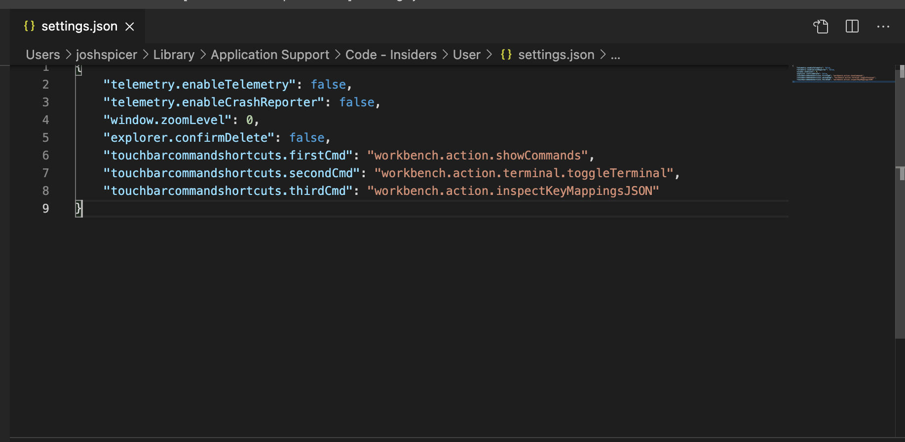

# Touchbar Command Shortcuts

A Visual Studio Code extension.  Adds an touchbar shortcut to **_any_** arbitrary VSCode command from **_any_** installed extension.

## Setup

Simply add the [command](https://code.visualstudio.com/api/extension-guides/command) to your editor settings and reload VSCode.

